# Object Detection in an Urban Environment

## Data

For this project, we will be using data from the [Waymo Open dataset](https://waymo.com/open/).

[OPTIONAL] - The files can be downloaded directly from the website as tar files or from the [Google Cloud Bucket](https://console.cloud.google.com/storage/browser/waymo_open_dataset_v_1_2_0_individual_files/) as individual tf records. We have already provided the data required to finish this project in the workspace, so don't need to download it separately.

## Structure

### Data

The data we have used for training, validation and testing is organized as follow:
```
/home/workspace/data/
 - train: contain the train data
 - val: contain the val data
 - test: contains 3 files to test your model and create   inference videos
```
### Experiments
The experiments folder is organized as follow:
```
experiments/
- pretrained_model/
- exporter_main_v2.py - to create an inference model
- model_main_tf2.py - to launch training
- reference/ - reference training with the unchanged config file
- experiment1/ - create a new folder for each experiment you run
- label_map.pbtxt
    
```
### Exploratory Data Analysis

The waymo dataset contains information about images and associated bounding boxes with each image. we have detected three types of objects vehicles, pedestrians and cyclists.

The function display image will randomly display 10 images as shown below:


Next, I have randomly selected 30K samples to check class distribution.

For the better model performance dataset must be balanced  i.e. dataset with uniform distribution of class but in our case Dataset is highly imbalanced.

The figure below shows that number of vehicle is much more than pedestrain and cyclist. Model will not be trained well to detect the pedestrain and cyclist.

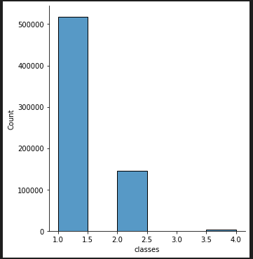


### Edit the config file

Object Detection API relies on **config files**. The config that we will use for this project is `pipeline.config`, which is the config for a SSD Resnet 50 640x640 model. You can learn more about the Single Shot Detector [here](https://arxiv.org/pdf/1512.02325.pdf).

First, let's download the [pretrained model](http://download.tensorflow.org/models/object_detection/tf2/20200711/ssd_resnet50_v1_fpn_640x640_coco17_tpu-8.tar.gz) and move it to `/home/workspace/experiments/pretrained_model/`.

We need to edit the config files to change the location of the training and validation files, as well as the location of the label_map file, pretrained weights. We also need to adjust the batch size. To do so, run the following:
```
python edit_config.py --train_dir /home/workspace/data/train/ --eval_dir /home/workspace/data/val/ --batch_size 2 --checkpoint /home/workspace/experiments/pretrained_model/ssd_resnet50_v1_fpn_640x640_coco17_tpu-8/checkpoint/ckpt-0 --label_map /home/workspace/experiments/label_map.pbtxt
```
A new config file has been created, `pipeline_new.config`.

### Training

We have moved the `pipeline_new.config` to the `/home/workspace/experiments/reference` folder. Now launch the training process:

* a training process:
```
python experiments/model_main_tf2.py --model_dir=experiments/reference/ --pipeline_config_path=experiments/reference/pipeline_new.config
```
Once the training is finished, launch the evaluation process:

* an evaluation process:
```
python experiments/model_main_tf2.py --model_dir=experiments/reference/ --pipeline_config_path=experiments/reference/pipeline_new.config --checkpoint_dir=experiments/reference/
```


To monitor the training, we can launch a tensorboard instance by running `python -m tensorboard.main --logdir experiments/reference/`. 

First I have run the reference experiments with default settings with batch size of 2. 

### Improved Performance 

For improving model performance, I have explored the different data augmentation method available in the TF object Detection API.
#### Augmentation 

I have selected the below augmentation strategies:

- random_horizontal_flip
- random_crop_image
- random_adjust_contrast
- random_adjust_saturation
- random_adjust_brightness
- random_adjust_hue

I have shown below the below images with these augmentations.

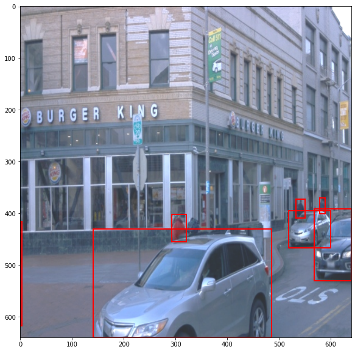  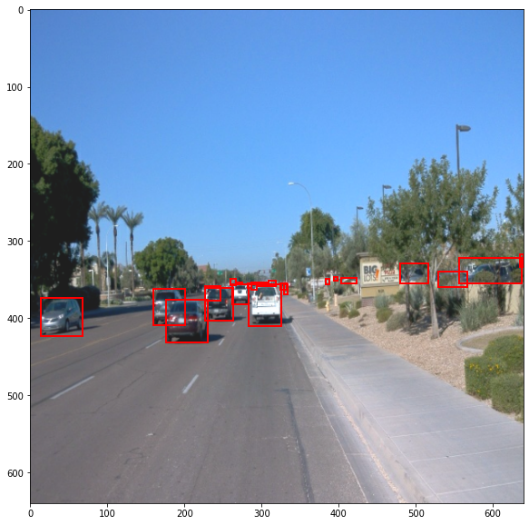

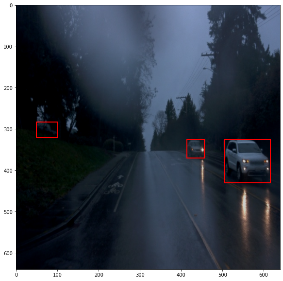  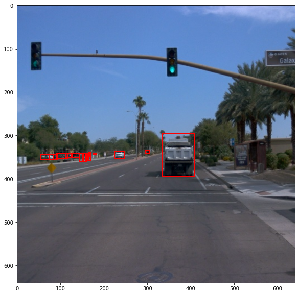

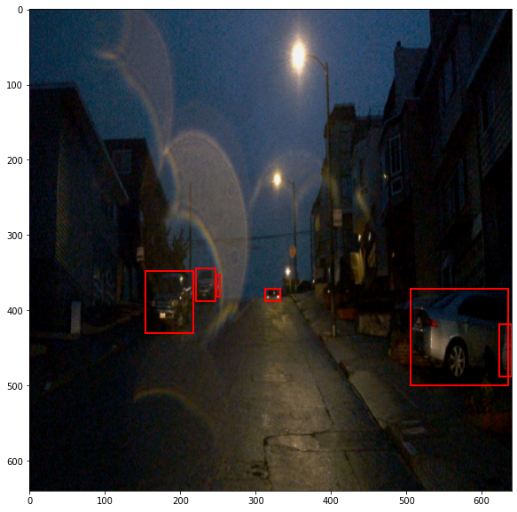  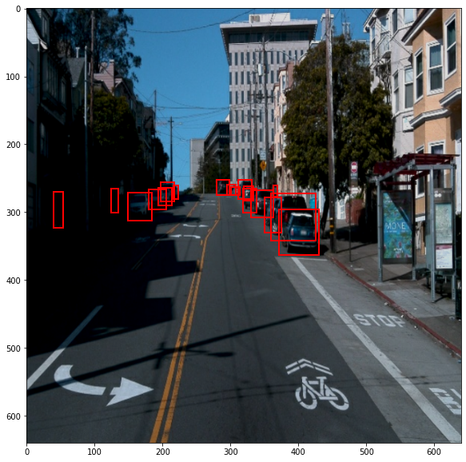

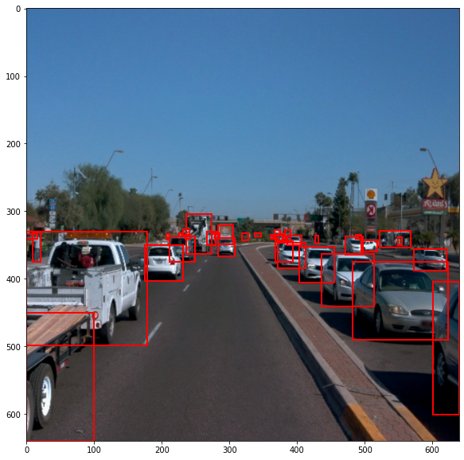  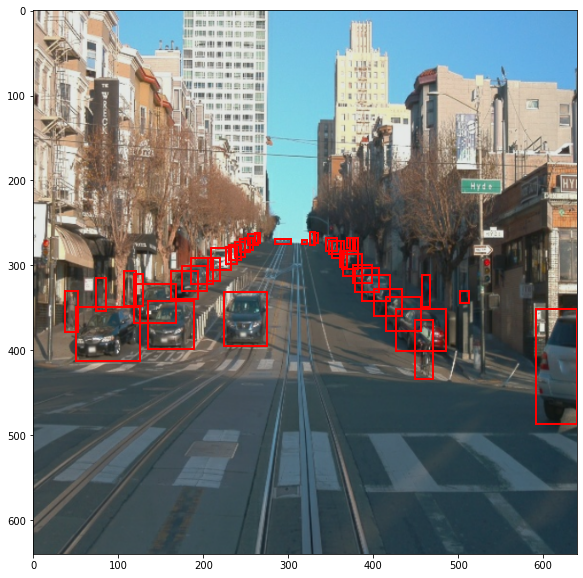

### Experiment 

I have used the momentum_optimizer with cosine_decay_learning_rate. 

I have changed the learning rate base to 0.004, total steps to 5000,  warmup_learning_rate to 0.001 and warmup_steps to 300.

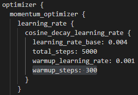

### Results 

In the below images, we can see the loss for reference model and improved model. 

### Loss

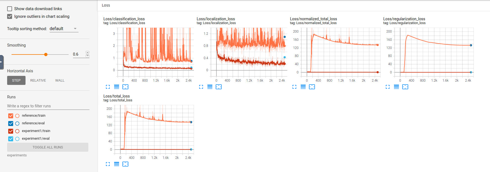

The below images shows the change in the precision and recall values.

### Precision

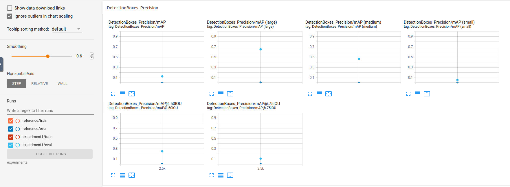

### Recall

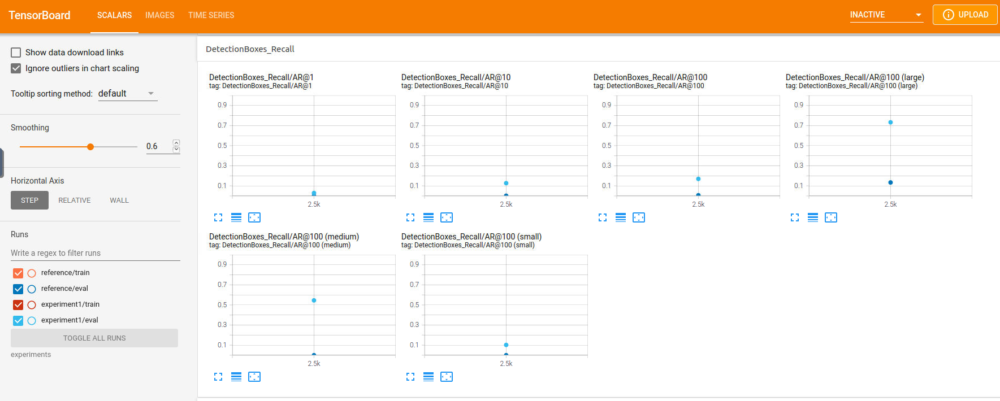


Overall, the training and validation loss of improved model(augmented model with changed optimizer parameters) are decreased in comparison with the losses of reference model.
Better performance is observed in the precision and recall plot. We need to fix the issue of imbalance dataset by adding more samples of pedestrians and cyclists. The improvement of dataset plays an important role in the loss curves and bring better classification performance.

### Creating an animation
#### Export the trained model
We can modify the arguments of the following function to adjust it to models:

```
python experiments/exporter_main_v2.py --input_type image_tensor --pipeline_config_path experiments/reference/pipeline_new.config --trained_checkpoint_dir experiments/reference/ --output_directory experiments/reference/exported/
```

This should create a new folder `experiments/reference/exported/saved_model`. You can read more about the Tensorflow SavedModel format [here](https://www.tensorflow.org/guide/saved_model).

Finally, we can create a video of your model's inferences for any tf record file. To do so, run the following command (modify it to your files):
```
python inference_video.py --labelmap_path label_map.pbtxt --model_path experiments/reference/exported/saved_model --tf_record_path /data/waymo/testing/segment-12200383401366682847_2552_140_2572_140_with_camera_labels.tfrecord --config_path experiments/reference/pipeline_new.config --output_path animation.gif
```

After the trained model is exported, we perform object detection with the model on driving scenes stored in the test set.

The object detection results are shown in the video below:

### Test Image 1


### Test Image 2


### Test Image 3


